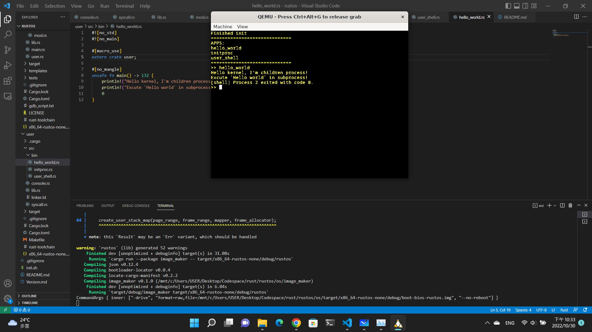

# rustos
Experimental OS base on 
 - [blog_os](https://github.com/phil-opp/blog_os)
 - [xfoxfu/rust_xos](https://github.com/xfoxfu/rust-xos)
 - [arrayJY/os](https://github.com/arrayJY/os)
 - [rcore-os/rCore](https://github.com/rcore-os/rCore-Tutorial-v3)

Goal:
1. ~~Without all assembly and link file, depends on bootloader and x86_64 crate.~~
> Context switch will need to use naked function, it's not realistic without assembly in kernel code
2. ~~Filesystem~~
> Filesystem is based on stdio, thus we only need to focus on device io (read, write, seek, and so on) in kernel<br>
> Designation: hardware - kernel ---------- syscall - stdio - filesystem<br>
>              hardware - kernel - driver - syscall --------- filesystem 
3. ~~Network interface~~
> This is also based on filesystem

> The Filesystem and Network interface will be the next project with stdandard library

### User shell
Date: 2022-10-30


---
# Install

1. install toolchain
```bash
./init.sh
```

2. build user programe
```bash
cd user
make
```

3. build and run kernel
```bash
cd os
cargo clean && cargo krun
```


---
TODO LIST && Known BUG:
1. - [ ] ~~Convert TSS table into implementation with memory allocator~~
2. - [x] Fix render overflow
3. - [x] Make textrenderer support cursor
4. - [ ] Package TextWriter as editor and console
        - [ ] Document it!
        - [ ] Editor
        - [ ] Console
        - [ ] Support Del?
5. - [x] Setup kernel process
6. - [x] `print` and `println` not work, need to check framebuffer and textwritter
7. - [ ] clean warning

> Note.
>
> 1. Leave the Qemu: ctrl+a x (-serial mon:stdio)
> 2. keyboard interrupt only work on graphic mode currently

---
# Future works
 - [x] TextWriter: Support console like input
 - [x] Make cargo ktest work
 - [ ] Implement APIC (current use 8259 PIC)
 - [ ] Learn E820 (memory controller?)
 - [ ] Waiting for new version of [osdev/bootloader](https://github.com/rust-osdev/bootloader) and rewrite

---
# ChangeLog
[2022-10-30]
1. BUGFIX: Context switch will be arbitrary crushed, due to idt overflow
 > Add a guard stack when step up tss table
2. BUGFIX -- STDIN: children process framebuffer render not work 
 > Add framebuffer memory_set copy into `memory.page.mod.kernel_mapped_new_page_table`
3. BUGFIX: framebuffer writer will crash at last byte
 > Fix cursor render
4. BUGFIX: Print key typing in framebuffer
5. MODIFY: user_shell improve

[2022-10-29]
1. Implement process and context switch
2. BUG: STDIN

[2022-10-27]
1. Error: syscall jmp to 0x0H in user mode

[2022-09-28]
1. enter user mode
2. syscall/sysretq

[2022-09-26]
1. Setup syscall software interrupt
2. Learn on ext2 filesystem

[2022-08-31]
1. Finished async implement

[2022-08-25]
1. Finished keyboard interrupt
2. Update TextEditor: Support cursor, Bugfix

[2022-08-24]
1. Solve ireqt double fault exception

[2022-08-23]
1. Setup interrupt handler: breakpoint, doubl_fault

[2022-08-22]
1. Modulize unittest, qemu, panic handler
2. Fix ktest error: https://github.com/rust-lang/cargo/issues/7359


[2022-08-21]
1. Change module name: render -> renderer
2. Make document for renderer
3. Append features: change fore/background color for TextWriter

[2022-08-20]
1. Due to make the screen output interface consistent on both bios and uefi, VGA_Buffer no longer to use.
2. Package the screen print interface from bootloader logger as library/render.

[2022-08-19] 
1. Initialization this project.
2. bootloader Config setting: https://docs.rs/bootloader/latest/bootloader/struct.Config.html#structfield.kernel_stack_size
