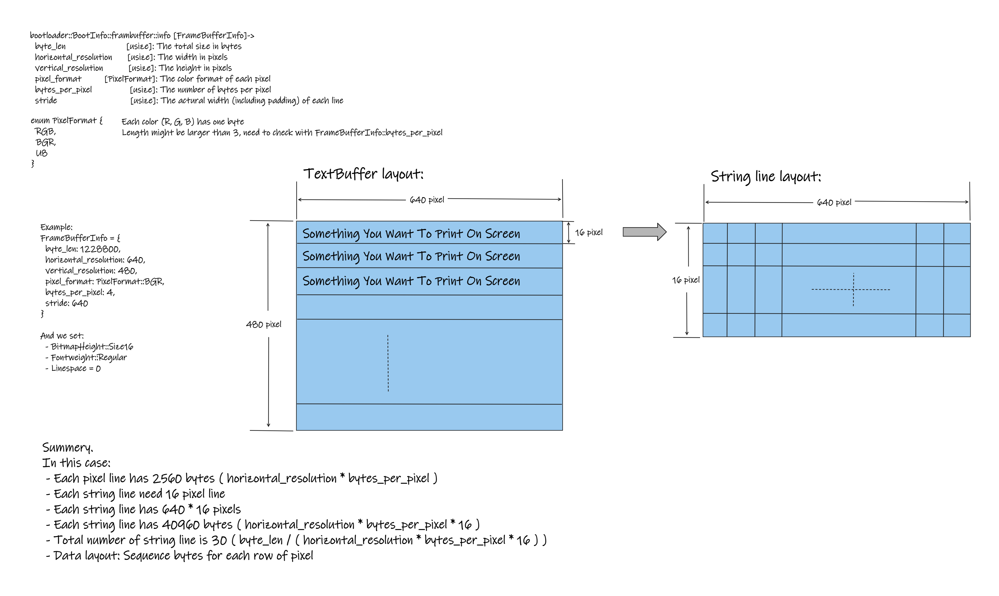

# bootloader::FrameBuffer

## Structure:


> When the textwriter run out last pixel and still have other inputs, the Framebuffer will automatical change to the new page (clear it and move cursor to the first index).

---
## Package Interface:

Source code come from bootloader: src/binary/logger.rs, and modified the interface like as [blog_os - VGA Text Mode](https://os.phil-opp.com/vga-text-mode/)

ref. https://github.com/rust-osdev/bootloader/blob/main/src/binary/logger.rs

Code snapshot: [src/library/renderer/mod.rs](./renderer.md)

```rust
// src/library/renderer/mod.rs
// show above `Code snapshot`
...
//

// usage
// src/lib.rs
#![no_std]
use bootloader::BootInfo;
#[macro_use]
pub mod library;

pub fn init(boot_info: &'static mut BootInfo) {
    library::renderer::init(boot_info);
}

// src/main.rs
...
use bootloader::{entry_point, BootInfo};
entry_point!(kernel_main);

fn kernel_main(boot_info: &'static mut BootInfo) -> ! {
    ${crate_name}::init(boot_info);
    ...
}
...

```

---
## Interface description

## function
 - init : Initialize TextWriter as static variable -> TEXTWRITER: OnceCell<Mutex<TextWriter>>
 - TextWriter::new : Build instance of text writer
 - TextWriter::clear : Clear screen with black background color
 - TextWriter::cursor_last_line : move cursor to last line left side, just like as terminal
 - TextWriter::shift_frame : shift all context up n string lines
 - TextWriter::write_char : print a character at current cursor position
 - TextWriter::set_foreground_color : Change foreground (text) color
 - TextWriter::set_background_color : Change background color
 
## support macro
 - write
 - print
 - println
