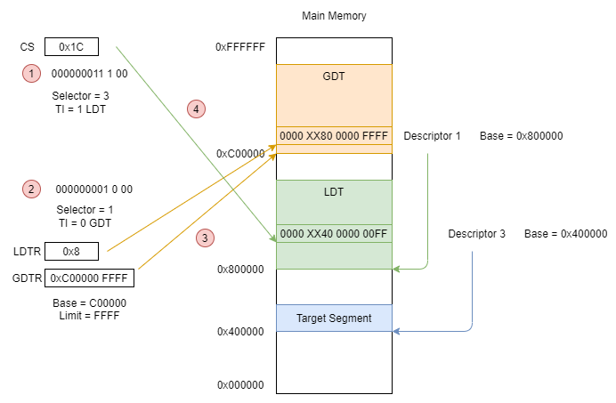

# Description Table

### Access step:
 * [GDT](https://www.twblogs.net/a/5b89f4f32b71775d1ce4a8ce)

1. Read from CS -> need to find GDT
2. Used GDTR pointing to GDT 
3. CS show the index of GDT -> GDT entry
4. Used GDT entry to specified acturally memory position (data position)

 * [LDT](https://medium.com/@cousin3516/%E8%99%95%E7%90%86%E5%99%A8%E4%B8%AD%E7%9A%84%E8%A8%98%E6%86%B6%E9%AB%94%E5%88%86%E6%AE%B5-memory-segmentation-b28bc10b437)

1. Read from CS -> need to find LDT
2. Used GDTR pointing to GDT and LDTR find the entry index -> LDT position
3. CS show the index of LDT -> LDT entry
4. Used LDT entry to specified acturally memory position (data position)

> Note. Selector can use CS, DS, ES, SS, FS, GS.

---
## Reference

[https://medium.com/@cousin3516/%E8%99%95%E7%90%86%E5%99%A8%E4%B8%AD%E7%9A%84%E8%A8%98%E6%86%B6%E9%AB%94%E5%88%86%E6%AE%B5-memory-segmentation-b28bc10b437](https://medium.com/@cousin3516/%E8%99%95%E7%90%86%E5%99%A8%E4%B8%AD%E7%9A%84%E8%A8%98%E6%86%B6%E9%AB%94%E5%88%86%E6%AE%B5-memory-segmentation-b28bc10b437)

[https://blog.csdn.net/cy295957410/article/details/112153800](https://blog.csdn.net/cy295957410/article/details/112153800)

[https://blog.csdn.net/ice__snow/article/details/50654629](https://blog.csdn.net/ice__snow/article/details/50654629)