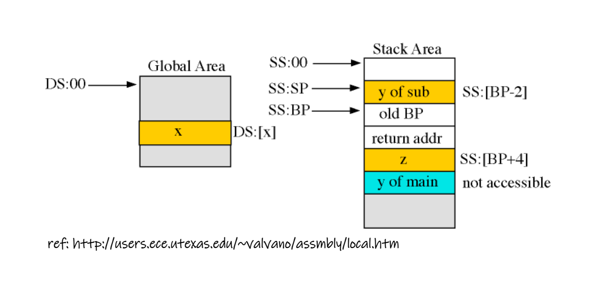

# Register
 - CS: code segment register
 - DS: data segment register
 - SS: stack segment register
 - ES: extra segment register
 - FS: general F segment register
 - GS: general G segment register

---
## [Segment](https://pages.cs.wisc.edu/~remzi/OSTEP/vm-segmentation.pdf)
Backgound:
 - 20 address bus
 - 16 bits address register
Thus, 8086/8088 defined (16bit<<4)+16bit to represent 20bits which will able to use 20 address bus.

> 20 address bus can represent
>
> 0b1111_1111_1111_1111 = 0xF_FFFF = 1048576 = 1MiB
>
> Transform formular define as HHHH:LLLL which can represent as 
> $$0xH\_HHH0 + 0xLLLL$$
> and the maximum value is
> $$0xF\_FFF0 + 0xFFFF = 0x10\_FFEF$$
> But this is over 20 address bus handle range, so it will drop the largest bit and represent as `0xFFEF`. This mechinism was called as `wrap-around` and control by `A20 Gate` (if a20 gate be supported).
> 
>> A20-Gate
>> - Enable: Represent the current address
>> - Disable: Represent as 8086/8088 address, which mean drop the largest bit

A20 gate: used to represent 20 address bus condition

ie.
When we want to address 0xFFFF, we can set:
 - 0000:FFFF 
 - 000F:FF0F
 - 00F0:F0FF
 - 0FFF:000F
 - ... and so on

> Layout: SegmentRegister:Offset
> 
> Due to lagecy design, the memory address will be defined as 
> $$Address = SegmentRegister*16+Offset$$
> or
> $$Address = SegmentRegister<<4+Offset$$

---
### CPU instruction
posiiton: CS:IP

### Data 
position: DS:BX | DS:DI | DS:SI
position: ES:BX | ES:DI | ES:SI
position: DS:[bx] can be simplfied as [bx], but not other segment registers. This mean only ES:[bx] is valid (for exmaple).

 - DS:[bx] => Valid
 - [bx] represent DS:[bx] => Valid
 - ES:[bx] => Valid
 - [bx] represnet ES:[bx] => Invalid

### [Stack](https://stackoverflow.com/a/8643013)
postion:
 - 16-bits (real mode, segment): 
    - SS:SP => Stack top pointer
    - SS:BP => Stack base pointer
 - 32-bits: ESP

---
## ref:

[Segment](https://pages.cs.wisc.edu/~remzi/OSTEP/vm-segmentation.pdf)

[https://developer.aliyun.com/article/717360](https://developer.aliyun.com/article/717360)

[https://blog.csdn.net/Apollon_krj/article/details/70767140](https://blog.csdn.net/Apollon_krj/article/details/70767140)

[https://reverseengineering.stackexchange.com/questions/2006/how-are-the-segment-registers-fs-gs-cs-ss-ds-es-used-in-linux](https://reverseengineering.stackexchange.com/questions/2006/how-are-the-segment-registers-fs-gs-cs-ss-ds-es-used-in-linux)

[https://www.cs.virginia.edu/~evans/cs216/guides/x86.html](https://www.cs.virginia.edu/~evans/cs216/guides/x86.html)

[https://ianchen0119.web.nycu.edu.tw/2021/06/04/x86-assembly/](https://ianchen0119.web.nycu.edu.tw/2021/06/04/x86-assembly/)

[http://users.ece.utexas.edu/~valvano/assmbly/local.htm](http://users.ece.utexas.edu/~valvano/assmbly/local.htmSegmentRegister.png)